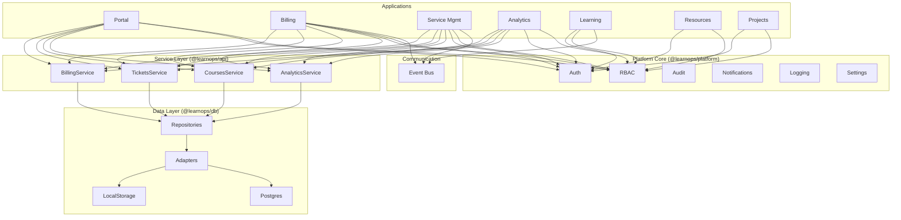

# LearnOps Suite — Complete Project Summary

# LearnOps Suite

## Overview
The **LearnOps Suite** is a unified internal management platform built as a **Modular Monolith** within a Monorepo. This approach was chosen to provide the deployment simplicity and developer experience of a monolith while enforcing strict boundaries between different business domains (similar to microservices).

It is evolving into a production-grade SaaS platform handling multiple organizations, distributed analytics, robust configuration management, and full system observability.

## Architecture

*   **Monorepo:** Uses `pnpm` workspaces for isolated package management.
*   **Modular Monolith:** Services (Portal, Billing, Service Management, Learning, Analytics) run individually but communicate via a unified API Gateway and a central Event Bus.
*   **API Gateway:** Proxies all incoming requests (`apps/gateway` on port 4000) to underlying services, handling routing, rate limiting, and centralized authentication validation.
*   **Domain-Driven Design (DDD):** The API packages are split into Domains, Value Objects, DTOs, and Handlers (e.g., `packages/api/src/billing`).
*   **Event-Driven Communication:** Modules communicate asynchronously using a typed Domain Event Bus (`packages/shared/events`), upgraded with rich DDD metadata (CQRS/Event Sourcing concepts).
*   **Background Jobs:** Managed by `packages/jobs` holding a robust JobQueue and system workers for SLAs, billing, and analytics aggregations.
*   **Technology Stack (Conceptual):**
    *   **Frontend:** Next.js (conceptual, UI components exist in `packages/ui` split by domains `src/features`)
    *   **Backend:** Express (Gateway), Next.js API Routes / Node.js
    *   **Styling:** Tailwind CSS (configured via centrally managed presets)
    *   **Database:** Conceptually PostgreSQL (migrations in `infrastructure/database`), currently using local storage or simulated state.
    *   **Observability:** Prometheus, Grafana, custom Tracing and Metrics package (`packages/observability`).

---

## 🚀 What It Does

### Core Modules
| Module | Port | Purpose |
|---|---|---|
| **Portal** | 3000 | Central dashboard, navigation hub, system-wide activity feed |
| **Billing** | 3001 | Invoice management, payment tracking, financial summaries |
| **Service Management** | 3002 | Ticketing, approvals, SLA tracking, agent assignment |
| **Analytics** | 3003 | Cross-module KPIs, data visualization, exportable reports |

### Support Modules
| Module | Port | Purpose |
|---|---|---|
| **Learning Hub** | 3004 | Course catalog, progress tracking, enrollments |
| **Resource Center** | 3005 | Documentation repository, knowledge base |
| **Project Tracker** | 3006 | Task management, project workflows |

---

## 🏗️ Architecture

### Modular Monolith Pattern

```
Monorepo → Modular Monolith → Shared Platform Core
```



### Data Flow

```
App → Service Layer → Repository → Adapter → Storage (LocalStorage / Postgres)
```

### Cross-Module Communication

```
Module A publishes event → Event Bus → Module B subscribes → Handles event
```

Example flow:
1. Student enrolls in course → Learning Hub publishes `student.enrolled`
2. Billing subscribes → creates invoice → publishes `invoice.created`
3. Analytics subscribes → updates enrollment KPI

---

## 📂 Complete File Structure

```
learnops-suite/
│
├── apps/
│   ├── core/
│   │   ├── portal/                          # Main Hub (port 3000)
│   │   │   ├── app/
│   │   │   │   ├── globals.css
│   │   │   │   ├── layout.tsx
│   │   │   │   ├── page.tsx
│   │   │   │   ├── billing/
│   │   │   │   ├── dashboard/
│   │   │   │   ├── login/
│   │   │   │   ├── permits/
│   │   │   │   ├── services/
│   │   │   │   └── settings/
│   │   │   ├── components/
│   │   │   ├── package.json
│   │   │   ├── next.config.ts
│   │   │   └── tsconfig.json
│   │   │
│   │   ├── billing/                         # Finance Module (port 3001)
│   │   │   ├── app/
│   │   │   ├── components/
│   │   │   ├── package.json
│   │   │   └── next.config.ts
│   │   │
│   │   ├── service-management/              # Ticketing Module (port 3002)
│   │   │   ├── app/
│   │   │   ├── components/
│   │   │   ├── package.json
│   │   │   └── next.config.ts
│   │   │
│   │   ├── analytics/                       # Reports Module (port 3003)
│   │   │   ├── app/
│   │   │   ├── components/
│   │   │   ├── package.json
│   │   │   └── next.config.ts
│   │   │
│   │   └── student-portal/                  # Student View
│   │       ├── app/
│   │       ├── components/
│   │       ├── package.json
│   │       └── next.config.ts
│   │
│   ├── support/
│   │   ├── learning-hub/                    # Courses (port 3004)
│   │   │   ├── app/
│   │   │   ├── package.json
│   │   │   └── next.config.ts
│   │   │
│   │   ├── resource-center/                 # Knowledge Base (port 3005)
│   │   │   ├── app/
│   │   │   ├── package.json
│   │   │   └── next.config.ts
│   │   │
│   │   └── project-tracker/                 # Task Manager (port 3006)
│   │       ├── app/
│   │       ├── package.json
│   │       └── next.config.ts
│   │
│   ├── web/                                 # Legacy/Main web app
│   └── student-portal/                      # Alt student portal entry
│
├── packages/
│   ├── platform/                            # ★ Platform Core (@learnops/platform)
│   │   ├── src/
│   │   │   ├── index.ts                     #   Barrel export (all modules)
│   │   │   ├── auth/
│   │   │   │   └── index.ts                 #   OTP, sessions, login, logout, hasPermission
│   │   │   ├── rbac/
│   │   │   │   ├── index.ts                 #   RBAC barrel export
│   │   │   │   ├── roles.ts                 #   6 roles + hierarchy
│   │   │   │   ├── resources.ts             #   8 resources, 7 actions
│   │   │   │   ├── permissions.ts           #   Role-to-permission matrix
│   │   │   │   ├── policy.ts                #   can(), canWithOwnership(), getPermissions
│   │   │   │   └── guards.ts               #   API guards, extractContext, unauthorized/forbidden
│   │   │   ├── audit/
│   │   │   │   └── index.ts                 #   logAction(), getAuditLogs()
│   │   │   ├── notifications/
│   │   │   │   └── index.ts                 #   NotificationManager (send, read, clear)
│   │   │   ├── logging/
│   │   │   │   └── index.ts                 #   Structured JSON logger (debug→fatal)
│   │   │   └── settings/
│   │   │       └── index.ts                 #   Feature flags, platform config
│   │   ├── package.json
│   │   └── tsconfig.json
│   │
│   ├── api/                                 # ★ Service Layer (@learnops/api)
│   │   ├── src/
│   │   │   ├── index.ts                     #   Barrel export
│   │   │   ├── billing/
│   │   │   │   └── billing.service.ts       #   Invoice & customer operations
│   │   │   ├── service-management/
│   │   │   │   └── tickets.service.ts       #   Ticket CRUD, assignment, resolution
│   │   │   ├── learning/
│   │   │   │   └── courses.service.ts       #   Course CRUD, progress, enrollment
│   │   │   └── analytics/
│   │   │       └── analytics.service.ts     #   Cross-module KPI aggregation
│   │   ├── package.json
│   │   └── tsconfig.json
│   │
│   ├── db/                                  # ★ Data Layer (@learnops/db)
│   │   ├── src/
│   │   │   ├── index.ts                     #   Prisma singleton export
│   │   │   ├── adapters/
│   │   │   │   ├── index.ts                 #   Adapters barrel export
│   │   │   │   ├── adapter.interface.ts     #   IStorageAdapter interface
│   │   │   │   ├── localstorage.adapter.ts  #   LocalStorage implementation
│   │   │   │   └── prisma.adapter.ts        #   Postgres/Prisma implementation
│   │   │   ├── repositories/
│   │   │   │   ├── index.ts                 #   Repositories barrel export
│   │   │   │   ├── base.repository.ts       #   Generic CRUD (findAll, create, update, delete)
│   │   │   │   ├── invoice.repository.ts    #   Invoice-specific queries
│   │   │   │   ├── customer.repository.ts   #   Customer-specific queries
│   │   │   │   ├── ticket.repository.ts     #   Ticket assignment, resolution, SLA
│   │   │   │   └── course.repository.ts     #   Course progress, completion
│   │   │   └── schemas/
│   │   │       └── index.ts                 #   Zod validation schemas (all entities)
│   │   ├── prisma/
│   │   │   └── schema.prisma                #   Database schema
│   │   ├── package.json
│   │   └── tsconfig.json
│   │
│   ├── ui/                                  # Shared UI (@learnops/ui)
│   │   ├── src/
│   │   │   ├── index.ts                     #   Component barrel export
│   │   │   ├── components/
│   │   │   │   ├── layout/
│   │   │   │   │   ├── navbar.tsx           #   Top navigation bar
│   │   │   │   │   ├── sidebar.tsx          #   Side navigation panel
│   │   │   │   │   ├── footer.tsx           #   Footer component
│   │   │   │   │   ├── shared-layout.tsx    #   Main layout wrapper
│   │   │   │   │   └── topnav.tsx           #   Top nav variant
│   │   │   │   ├── glass-button.tsx         #   Styled button component
│   │   │   │   ├── bioluminescent-grid.tsx  #   Background grid effect
│   │   │   │   └── theme-provider.tsx       #   Theme context provider
│   │   │   └── utils/
│   │   │       └── cn.ts                    #   className merger utility
│   │   ├── package.json
│   │   └── tsconfig.json
│   │
│   ├── theme/                               # Design Tokens (@learnops/theme)
│   │   ├── index.ts
│   │   ├── package.json
│   │   └── theme.css                        #   CSS variables, accent colors
│   │
│   ├── shared/                              # Shared Utilities (@learnops/shared)
│   │   ├── index.ts                         #   Re-exports auth, store, events
│   │   ├── auth/
│   │   │   └── index.ts                     #   (legacy, migrated to platform)
│   │ ## Monorepo Project Structure

```text
education-portal-design/
├── apps/                 # Runnable applications
│   ├── gateway/          # API Gateway (Express, Port 4000)
│   ├── portal/           # Next.js Application (Port 3000)
│   ├── billing/          # Billing API/Service (Port 3001)
│   ├── services/         # IT Service Management API (Port 3002)
│   ├── analytics/        # Analytics & Reporting API (Port 3003)
│   └── learning/         # LMS platform (Port 3004)
├── packages/             # Shared libraries and domain logic
│   ├── api/              # Core business domains (DDD layout: entities, dto, handlers)
│   ├── platform/         # Core platform concerns (Identity, Auth, RBAC, Audit)
│   ├── ui/               # Shared React components and domain-specific Feature Modules
│   ├── shared/           # Cross-cutting utilities, types, and the EventBus
│   ├── jobs/             # Background job processing and workers
│   ├── observability/    # Metrics, Distributed Tracing, and Error Reporting
│   ├── config/           # Centralized configuration (Runtime env, Feature Flags)
│   └── contracts/        # API Contracts and Zod validations
├── infrastructure/       # Container, network, and database configuration
│   ├── docker/
│   ├── database/         # Postgres migrations
│   ├── monitoring/       # Prometheus and Grafana
│   ├── reverse-proxy/    # Nginx config
├── docs/                 # Documentation (Architecture Diagrams)
└── ...
```
│   │   ├── store/
│   │   │   └── index.ts                     #   MockStore (LocalStorage persistence)
│   │   ├── events/
│   │   │   └── index.ts                     #   ★ Typed EventBus (12 domain events)
│   │   └── package.json
│   │
│   ├── rbac/                                # (legacy, migrated to platform)
│   ├── audit/                               # (legacy, migrated to platform)
│   ├── types/                               # Shared TypeScript types
│   └── config/                              # ESLint, TSConfig presets
│       └── tsconfig.json
│
├── infrastructure/                          # ★ Infrastructure
│   ├── docker/
│   │   └── README.md                        #   Docker Compose usage guide
│   └── monitoring/
│       └── README.md                        #   Observability roadmap
│
├── docs/                                    # Documentation
│   ├── architecture.md                      #   Mermaid system diagrams
│   ├── overview.md                          #   Technical overview
│   ├── codebase.md                          #   Codebase walkthrough
│   ├── component-walkthrough.md             #   Component guide
│   └── decisions/
│       └── adr-001-modular-monolith.md      #   Architecture Decision Record
│
├── scripts/
│   └── dev.ps1                              #   PowerShell dev helper
│
├── docker-compose.yml                       #   Postgres + Portal containers
├── package.json                             #   Root workspace config
├── pnpm-workspace.yaml                      #   Workspace: apps/* + packages/*
├── pnpm-lock.yaml
├── components.json                          #   shadcn/ui config
├── .gitignore
├── README.md
├── PROJECT_SUMMARY.md                       #   ← This file
├── PROJECT DESCRIPTION                      #   Original project spec
├── CONFIG_REFERENCE.md
├── IMPLEMENTATION_CHECKLIST.md
├── SETUP_GUIDE.md
└── PROMPT V2 / PROMPT V3                    #   AI prompt iterations
```

---

## 💻 Technology Stack

| Layer | Technology |
|---|---|
| **Framework** | Next.js 15+ (App Router) |
| **Language** | TypeScript |
| **Styling** | Tailwind CSS 4.0 |
| **UI Components** | shadcn/ui (Radix primitives) |
| **Icons** | Lucide React |
| **Validation** | Zod |
| **Build Tooling** | TurboRepo, pnpm Workspaces |
| **Database** | LocalStorage (dev) / PostgreSQL (prod) |
| **Containerization** | Docker Compose |

---

## 🔒 Platform Core (`@learnops/platform`)

| Module | Purpose |
|---|---|
| **Auth** | OTP login, session management, permission checks |
| **RBAC** | 6 roles, granular permissions, policy engine, API guards |
| **Audit** | Structured action logging with actor/resource tracking |
| **Notifications** | Cross-module alerts with read/unread tracking |
| **Logging** | Structured JSON logging with levels and child loggers |
| **Settings** | Feature flags, platform configuration, defaults |

### Roles
`STUDENT` → `PROFESSOR` → `FINANCE_ADMIN` / `SUPPORT_AGENT` → `ADMIN` → `SUPER_ADMIN`

---

## 🔄 Event Bus (`@learnops/shared`)

Typed pub/sub system supporting 12 domain events:

| Category | Events |
|---|---|
| **Billing** | `invoice.created`, `invoice.paid`, `invoice.overdue`, `payment.received` |
| **Tickets** | `ticket.created`, `ticket.assigned`, `ticket.resolved` |
| **Learning** | `course.created`, `course.completed`, `student.enrolled` |
| **Auth** | `user.login`, `user.logout` |

---

## 🎨 Design Philosophy

**"Industrial Command Center"** aesthetic:
- Slate/Emerald palette, high contrast
- Sharp 0px border radius, heavy offset shadows
- High-density, breadth-first information display
- Per-app accent colors for module recognition

---

## 📊 Domain Ownership

| Domain | Owns | Never Touches |
|---|---|---|
| **Billing** | Invoices, payments, transactions | Courses, tickets |
| **Learning** | Courses, enrollments, progress | Invoices, tickets |
| **Service Mgmt** | Tickets, approvals, SLA, assignments | Courses, invoices |
| **Analytics** | KPIs, reports, aggregations | (read-only via events) |
