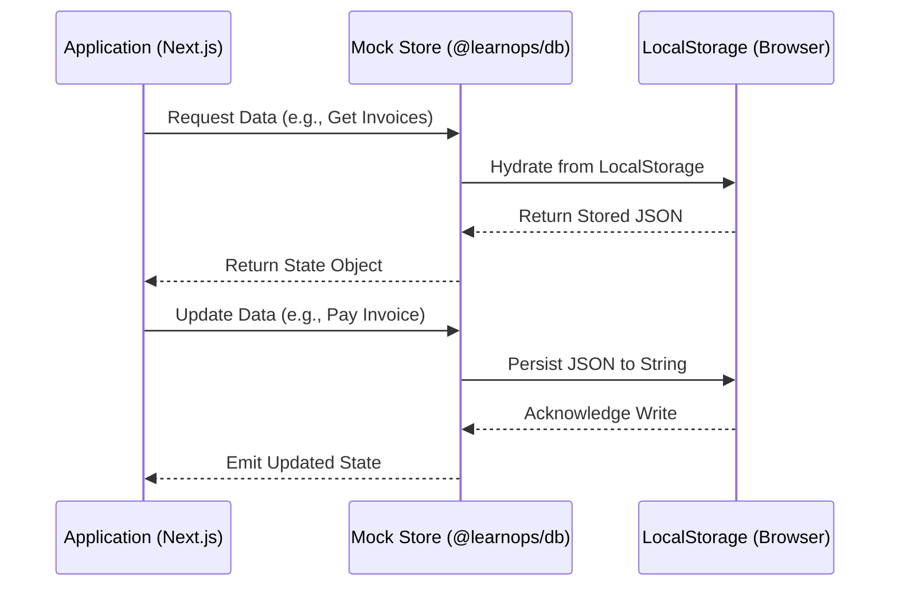
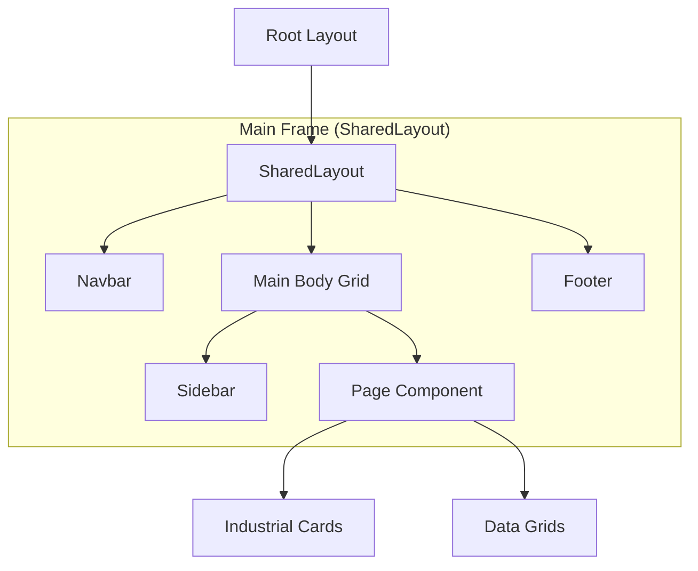

# Architectural Diagrams

This document visualizes the LearnOps Suite architecture using Mermaid diagrams.

## System Component Map
How applications interact with shared packages.

```mermaid
graph LR
    subgraph Applications
        P[Portal]
        B[Billing]
        A[Analytics]
        L[Learning Hub]
    end

    subgraph "Shared Packages"
        UI[@learnops/ui]
        TH[@learnops/theme]
        DB[@learnops/db]
        SH[@learnops/shared]
    end

    P & B & A & L --> UI
    P & B & A & L --> TH
    P & B & A & L --> DB
    P & B & A & L --> SH
```

## Data Flow (Mock Database)
The persistence and synchronization mechanism across apps.



## Global Layout Hierarchy
Standardized structure for all suite applications.



## Build Pipeline
Standardized Next.js transpilation flow.

```mermaid
graph LR
    TS[TypeScript Source] --> NX[Next.js Build]
    UI[@learnops/ui] --> |Transpile| NX
    DB[@learnops/db] --> |Transpile| NX
    NX --> OUT[Static/Edge Bundle]
```
