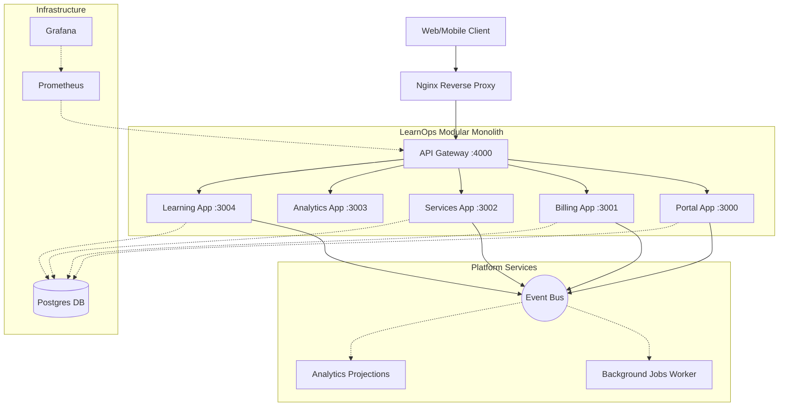

# LearnOps Suite Architecture

## Boundary Enforcement
- Modules communicate synchronously only via Gateway API boundaries or explicit shared contracts (`@learnops/contracts`).
- Modules communicate asynchronously via the typed `EventBus`.
- Domain boundaries (DDD) are strictly enforced within `packages/api/src/`.
- UI features are segmented per domain under `packages/ui/src/features/`.
