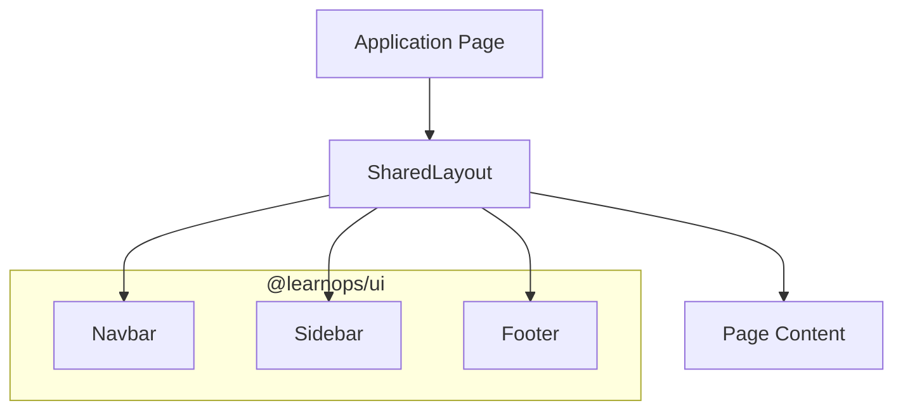

# Codebase & Component Map

This guide provides a deep dive into the LearnOps Suite repository structure and the relationships between its components.

## Repository Structure

```text
learnops-suite/
├── apps/                # Next.js Applications
│   ├── core/            # Mission-critical enterprise apps
│   │   ├── portal/      # The "Command Center"
│   │   ├── billing/     # Invoice & payment logic
│   │   └── ...
│   └── support/         # Auxiliary service apps
├── packages/            # Internal Shared Libraries
│   ├── ui/              # The Industrial Component Library
│   ├── theme/           # CSS Variables & Tailwind config
│   ├── db/              # In-memory mock store
│   └── shared/          # Constants, Types, & Store
├── docs/                # Technical Documentation
└── scripts/             # Build & Dev utilities
```

## Internal Package Map

### `@learnops/ui`
The primary source of truth for the UI. It contains:
- `SharedLayout`: The standard frame for all applications.
- `Navbar`: Global navigation and user context.
- `Sidebar`: Dynamic navigation with collapsing support.
- `Footer`: The industrial grid footer.

### `@learnops/theme`
Centralized styling configuration.
- `theme.css`: Defines the Slate/Emerald palette and standard offset shadows.
- Shared Tailwind configuration patterns.

### `@learnops/db`
A client-side mock database.
- Uses `localStorage` for persistence.
- Automatic seeding of demo data for all apps.
- Located at `/packages/db/src/store/`.

## Application Integration Pattern

All LearnOps applications follow a standard integration pattern for consistency:

1. **Layout**: Wrapping the application in `SharedLayout` from `@learnops/ui`.
2. **Styling**: Importing the global theme from `@learnops/theme`.
3. **Data**: Accessing the shared mock store from `@learnops/db`.
4. **Build**: Using `transpilePackages: ['@learnops/ui']` in `next.config.mjs`.

## Shared UI Hierarchy


